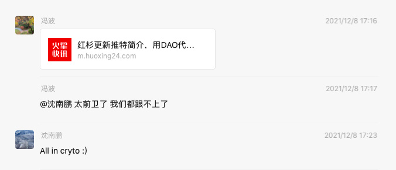

# 2021 年回顾

## Connect the Dots

刚毕业那几年还会写 "20xx 年总结" 这样的文章，不知道在哪一年已经失去了这个习惯。

今年发生了太多事情，让我非常有写点东西的想法。

叫 "总结" 好像过于古板，叫 "回顾" 可能比较合理，毕竟作为技术人，Code Review 是个很重要的环节。

之前也有想过人生可以用类似 Test-driven 的方法来执行，先写好"断言"，然后按照 tests 去做事情，到了一定的时间手工触发一次断言检测，以此来验证这段时间的工作、学习或者生活的效果。

但是实体世界的很多事情不是只有对或错，哪怕做错很多事情也没事。当下做错的事情，做错的选择可能以后某一天也会因此受益。

Steven Jobs 把这种「错误」的尝试叫做「Connect the dots」

那么我的 dots 有被 connect 起来吗？

有，今年才算真正的体会到这个感觉。

我本是一个叛逆的人，不喜欢按照大众的思想来为人处世，很多事情喜欢问一句"为什么？"，"凭什么？"，而区块链是一群叛逆的人一起构建的网络，「金钱自由」和「代码即自由」是我非常令我热血沸腾的事情。

作为一个技术人，「代码即法律」是一种具有浪漫主义&理想主义色彩，且稳定可靠的理念。

做传统开发的时候也习惯性的说 "Show me the code"，看到代码才能判断某个系统或工具是否真正可靠，而在区块链的世界，绝大部分东西都是开源的，并且有密码学为基础来保障所有参与者的安全，让想作恶的人无能为力。

做 Web2.0 研发养成的很多习惯在思维方式也是和 Web3.0 非常 match，比如适应阅读英文文档，习惯找一手资料，用英文提出问题解答问题，和项目方进行沟通。

更重要的是 DYOR(Do Your Own Research)，这个在 Web2.0 对人说有点不礼貌，但 Web3.0 的世界太正常不过了。 

工具化和逆向能力在 Web3.0 的领域也非常好用，干这类事情的人在 Web3.0 的领域被尊称为"科学家"。

热情也全部被点燃了，仿佛回到了当初努力做好 Web2.0 工作时的场景，简直焕发第二春。

适合自己的领域实在是太令人舒服了！

## All in crypto

今年最大的收获是 All in cryto :)

### All in 了哪些东西？

金钱和精力。

今年已经是大仓位在 Crypto 上了，以后也会把 Crypto 当主要的投资方向。

Web2.0 的事情基本不再干了，也提不起太多兴趣，参与了一个百倍币的研发工作，和家人们组成了一个 DAO，未来也会把主要精力放在做 Web3 的建设，Crypto 的研究与投资方面。

### 为什么要 All in？

今年的 Crypto 市场和以往已完全不一样。

今天可以说是 Web3.0 完成了萌芽，应用场景已经完成了 MVP，未来充满了想象力。

#### DEX

DEX 上币无须许可，冲击了 CEX传统的审核收费上币模式，任何人在 DEX 上添加流动性即可完成上币，上币完毕立马可交易。

AMM(自动做市商)的出现让做市变得无比简单，添加流动资金即可，剩下的事情程序会帮你搞定。

DEX 让交易变得简单安全透明可靠且便宜（暂时忽略 ETH 的高 gas，哈哈）。

DEX 交易额也开始逐渐超过 CEX，可以预见未来 DEX 将会慢慢替代掉 CEX。

#### DeFi

DeFi Summer 之后 DeFi TVL(总锁仓量)开始井喷式增长，已经成了链上最重要的应用场景之一。

DeFi 相比传统金融更加公开透明安全，无需信用背书、无需中心化的准入，资金来龙去脉一清二楚，逻辑都在公开的代码里面，简简单单的几百行代码就能完成传统银行几千甚至万人才能做成的事情。

#### NFT

今年是 NFT 爆发的一年。

最出圈的是以 BAYC 和 CryptoPunks 为代表的 PFP 类，这类应用场景很直接，但更具有想象力的是有使用价值的 NFT，比如身份认证、产权所有权等，同时也期待更多音频、视频等创意作品在链上出现。

#### GameFi

GameFi 是非常有想象空间的事情，把传统游戏的货币体系和物品属性用 Erc20 和 Erc721 Token 代替，能真正做到资产真正属于游戏玩家。

今年有不少链上游戏火爆市场，以 Axie Infinity 为主。

#### DAO

DAO 是我非常喜欢的东西， 一群志同道合的人聚在一起，为了共同的目标，可以碰撞出很多火花。

今年蹦出来好多有意思的 DAO，或许 DAO 会成为接下来市场的重点方向。

#### Alt Blockchain

今天以太坊竞争公链、侧链、L2 也出现了一定程度的爆发。

平行网络，多链齐发！

#### Metaverse

Metaverse 是今年最热的词之一了，热到 Web2.0 甚至传统行业的公司都在讨论这个事情。

Facebook All in Metaverse 是这个圈子最大的事情，除此之外并没有激起太大的火花，但可以肯定这是未来的重点方向。

#### 应用小结

以上这些应用场景或多或少存在问题。

DEX 上土狗币横飞；DeFi 往往是随着挖提卖币价被砸下去导致 APR 和 TVL 一起下降的死亡螺旋；GameFi 的游戏非常粗糙，品质远低于 Web2.0，随着游戏币的暴跌结束了短暂的生命周期；土狗 DAO 横飞，给各种链上玩家甚至 Web2.0 产品空投土狗币，一堆打着 DAO 的幌子做中心化事情的组织；公链质量参差不齐，甚至出现某公链宕机超过 24h 的滑稽事情。

但这些只是开始，从这些应用已经能让人有很多想象空间了，未来一定会更好。

#### 人才流入&资本关注

优秀人才的大量流入，资本的关注是赛道蓬勃发展的标志之一，过去一年人才和资本纷纷涌入 Web3.0 领域。

谁谁谁进军元宇宙，某某机构 All in crypto 已是常事。

## Love and lose

Steven Jobs 说："You’ve got to find what you love"，今年我确实找到了，并且沉迷其中。

沉迷其中也让我失去很多，对传统的工作提不起兴趣，和传统行业的朋友或从事传统投资的朋友有了很大的割裂感，交流都快有困难了。

有些事情会慢慢忘记，有些人也会消失在记忆里，思想的隔阂是极难克服的，也是没必要克服的，每个人都有自己要走的路，都有自己的圈子。

但我依旧很开心全身心投入这个行业，我也有一群理想主义者的 DAO 家人无话不谈，这就够了。

>Your time is limited, so don’t waste it living someone else’s life. Don’t be trapped by dogma — which is living with the results of other people’s thinking. Don’t let the noise of others’ opinions drown out your own inner voice. And most important, have the courage to follow your heart and intuition. They somehow already know what you truly want to become. Everything else is secondary.

遵循自己内心的想法，并按之行动，别的并不是那么重要。

## #BUDIL

今年有段时间花在撸毛赚钱上的时间太多，学习和建设的时间太少。这是个很不好的现象，这甚至有点违背我喜欢的做事风格，『但行好事，莫问前程』。

好在年末算上强迫自己纠正过来了，每天沉迷各种项目研究无法自拔，this is what I love.

>重点是 #BUDIL，赚钱只是附赠，不要本末倒置。牢记！

这是我今年元旦发的推特，希望能执行好。

最近看到一篇文章 [道路的选择，为什么Web3革命不会出现在中国？](https://mirror.xyz/0x0E58bB9795a9D0F065e3a8Cc2aed2A63D6977d8A/fsrtEeVftvNA4OGRTrQ7aZqqPWQ09foExSRDqeNxETc)，内容非常杀人诛心。

核心结论：

>中国不会触及Web3。 无论从文化历史的角度还是从国家战略的角度，Web3都与中国根本不相容。

很无奈的事实是 Web3.0 在迸发更多创新可能性，在颠覆着整个互联网，而跟中国基本没啥关系。

中国早晚会迎头追上，但目前看起来毫无希望。

虽然革命不会出现在中国，但这又怎样呢？

我们有一帮的革命先驱，他们就是敢于逆流而上，他们本是互联网或金融或其他领域的的精英人士，本可以拥有外人羡慕的那种很光明的生活，但是他们就是为了热爱一头扎进去，头也不回。

以一首最近很喜欢的歌结束这篇文章。

>爱你孤身走暗巷

>爱你不跪的模样

>爱你对峙过绝望

>不肯哭一场 

>爱你来自于蛮荒

>一生不借谁的光

>你将造你的城邦

>在废墟之上

>去吗 去啊 以最卑微的梦

>战吗 战啊 以最孤高的梦

>致那黑夜中的呜咽与怒吼

>谁说站在光里的才算英雄

<iframe width="560" height="315" src="https://www.youtube.com/embed/Hlp8XD0R5qo" title="YouTube video player" frameborder="0" allow="accelerometer; autoplay; clipboard-write; encrypted-media; gyroscope; picture-in-picture" allowfullscreen></iframe>