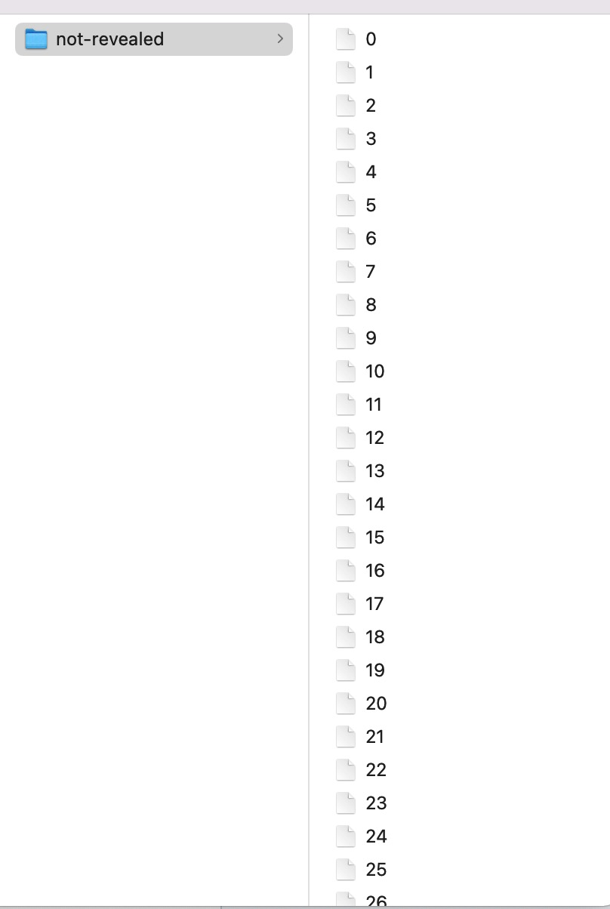
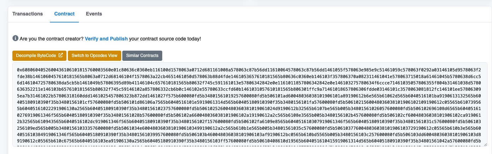
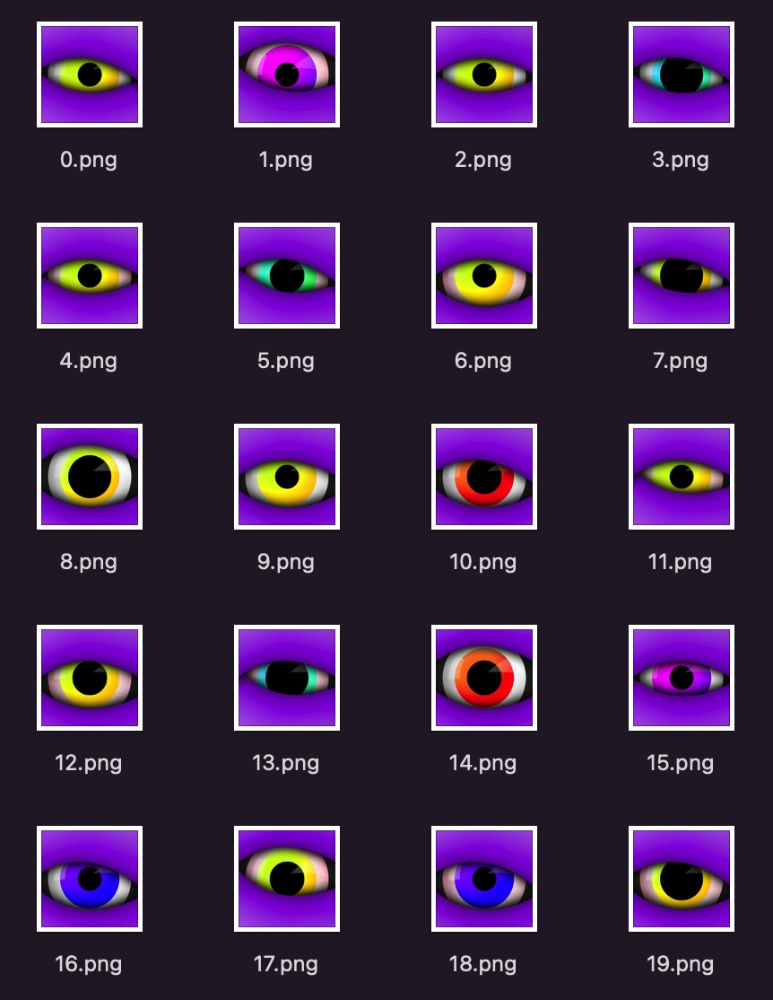

# NFT 从开发到上架 Opensea 全流程

最近参与了很多 NFT 项目的一级市场 mint 以及交易过程，也阅读了很多 NFT 项目的合约代码，自己还没实操过，并且全网也没找到此主题的文章。

此文章边做边写，不一定是最佳实践，但所有环节是本人亲自参与过的，keep your hands dirty, let's go.

此教程所有环节在科学上网环境下进行，有任何网络错误相关问题请检查你的科学上网是否流畅。


## 1. 生成钱包地址

部署 NFT 合约的时候需要有一个钱包地址作为合约的 deployer 和 owner，这里使用 [Metamask](https://metamask.io/) 作为钱包应用。

打开 Metamask 官网 [https://metamask.io/](https://metamask.io/)，点击 "Download now"，下载 Chrome 插件并安装。

如果有现成的私钥点击 "Import wallet"，如果没有点击 "Create a Wallet"，设置好密码，保管好助记词，助记词保管参考[偷不走的助记词](https://www.geekmeta.com/article/1220099.html)

## 2. 领取以太币

打开 Rinkeby 的水龙头 [https://faucet.rinkeby.io/](https://faucet.rinkeby.io/)，按照水龙头的 "How does this work?" 领取 Rinkeby 网络的以太币。

## 3. 准备盲盒图片和 meta info 文件

图片尺寸 512x512 px 最佳，上传到 ipfs 上。我这里使用的是 [https://www.pinata.cloud/](https://www.pinata.cloud/)，上传后得到图片 URL [https://gateway.pinata.cloud/ipfs/QmQvp2GyrBs5aKkT2UWg4p2cBbF1WDjCYgSBSmzeZzvFvv](https://gateway.pinata.cloud/ipfs/QmQvp2GyrBs5aKkT2UWg4p2cBbF1WDjCYgSBSmzeZzvFvv)，文件在 ipfs 上的 cid: QmQvp2GyrBs5aKkT2UWg4p2cBbF1WDjCYgSBSmzeZzvFvv

同时准备 N 个 Json 文件， N = 准备发售的 NFT 个数，格式如下

``` js
{
  "name": "Veryyoung NFT Demo #0",
  "description": "veryyoung nft demo",
  "image": "ipfs://QmQvp2GyrBs5aKkT2UWg4p2cBbF1WDjCYgSBSmzeZzvFvv",
  "attributes": []
}
```

名字编号做成自增，description 可以随意写， image 内容填 ipfs://+刚刚准备的文件 cid

我准备了个脚本来自动生成所有盲盒 json 文件，代码见 [unreveal.js](https://github.com/veryyoung/nft-demo/blob/main/scripts/unreveal.js)

执行后效果如下




将 metadata 上传到 ipfs，得到 folder 的 cid：QmPphQMMEhwmXMp3m4sJrtL9xqAX8emiXBZw8UeVGhqZhK


## 4. 编写合约代码

代码见 [VeryyoungNFTSimpleDemo.sol](https://github.com/veryyoung/nft-demo/blob/main/contracts/VeryyoungNFTSimpleDemo.sol)

这里有几个需要注意的：

1.  留了方法 setBaseURI 来修改 baseurl，用来开图。
2.  拒绝合约调用，防止使用合约来批量调用（NFT初期很多项目被用合约批量 mint，某数字 DAO 因此一战成名）
3.  withdraw 方法使用了 call 而不是直接使用 tranfer 函数，防止被恶意利用，具体原因参考 [Don't use transfer() or send()](https://consensys.github.io/smart-contract-best-practices/recommendations/#dont-use-transfer-or-send)
4.  敏感方法加上了 onlyOwner 修饰符，仅允许合约拥有者(也就是部署合约的那个地址)进行操作
5.  使用 [ERC721A](https://github.com/chiru-labs/ERC721A) 降低 mint 多个的 gas

## 6. 编写测试

参考 [simple_demo.spec.js](https://github.com/veryyoung/nft-demo/blob/main/test/simple_demo.spec.js)

我在本地 [Ganache](https://trufflesuite.com/ganache/) 跑的测试，有其他网络需求记得修改 hardhart 配置里的 url 和端口

## 7. 部署合约

先在本地执行部署 

``` bash
yarn deploy:simple
```

部署成功会如下提示：

``` bash
yarn run v1.22.10
$ npx hardhat run scripts/deploy_simple.js
Veryyoung simple NFT demo contract deployed to: 0x5FbDB2315678afecb367f032d93F642f64180aa3
✨  Done in 3.96s.
```

部署其他网络需要申请 [infura](https://infura.io/)，可以理解为一套远端的以太坊节点，提供了标准的 RPC API 供使用，避免开发者自己在本地跑以太坊节点的麻烦。

申请后把 key 放到 .env 的 INFURA_KEY 里。

同时把钱包的助记词放在 .env 的 MNEMONIC 里，一定要注意小心助记词泄露，比如被程序兼听剪切板，比如文件泄露，比如文件随着代码上传到远端。

一切都配置好后执行

``` bash
yarn deploy:simple
```

或者

``` bash
npx hardhat run scripts/deploy_simple.js --network rinkeby
```

成功后会提示：

``` bash
yarn run v1.22.10
$ npx hardhat run scripts/deploy_simple.js --network rinkeby
Veryyoung simple NFT demo contract deployed to: 0xF82E39Ce459786cC9AE3602Eed9c288B4FBBE785
✨  Done in 23.47s.
```
合约部署成功！

## 8. 开源代码

打开 etherscan 可以看到部署的合约 [https://rinkeby.etherscan.io/address/0xf82e39ce459786cc9ae3602eed9c288b4fbbe785](https://rinkeby.etherscan.io/address/0xf82e39ce459786cc9ae3602eed9c288b4fbbe785)，



代码是未验证的，也就是未开源的。

在 Web3 的世界里（起码 NFT 的世界里），合约代码是必须开源的。

申请个 etherscan 的 api，放在 .env 里面。

执行命令

``` bash
npx hardhat verify --network rinkeby 0xF82E39Ce459786cC9AE3602Eed9c288B4FBBE785 "Veryyoung NFT Simple Demo" "VNSD" "ipfs://QmPphQMMEhwmXMp3m4sJrtL9xqAX8emiXBZw8UeVGhqZhK/"
```
请确保 verify 的参数和 deploy 的时候保持一致。

如果 verify 成功，会有如下输出：

``` bash
Nothing to compile
Compiling 1 file with 0.8.4
Successfully submitted source code for contract
contracts/VeryyoungNFTSimpleDemo.sol:VeryyoungNFTSimpleDemo at 0xF82E39Ce459786cC9AE3602Eed9c288B4FBBE785
for verification on Etherscan. Waiting for verification result...

Successfully verified contract VeryyoungNFTSimpleDemo on Etherscan.
https://rinkeby.etherscan.io/address/0xF82E39Ce459786cC9AE3602Eed9c288B4FBBE785#code
```

现在再看，合约已经开源了 [https://rinkeby.etherscan.io/address/0xf82e39ce459786cc9ae3602eed9c288b4fbbe785#code](https://rinkeby.etherscan.io/address/0xf82e39ce459786cc9ae3602eed9c288b4fbbe785#code)


## 9. mint NFT

打开刚刚的合约地址，点击 "Connect to Web3" 连上小狐狸，点击 "Write Contract"，找到 mint 函数，第一个参数写 0.1（mint 价格），第二个参数写  mint 数量（1-5 之间），Wirte，然后等待执行。

执行成功后返回 tx [https://rinkeby.etherscan.io/tx/0x7f29aa3dbccda24a3e1d6ea6b9a7ddffcbd05755f35ec318355e897bd38c93f4](https://rinkeby.etherscan.io/tx/0x7f29aa3dbccda24a3e1d6ea6b9a7ddffcbd05755f35ec318355e897bd38c93f4)，可以看到 NFT 已经铸造成功，并打到了我的钱包地址。

此处用户体验不太适合普通用户进行操作，可以自己开发网页，用 [ethers.js](https://docs.ethers.io/v5/) 或者 [web3.js](https://web3js.readthedocs.io/en/v1.5.2/) 这样的组件来连接钱包，图形化的进行 mint 操作。


## 10. 上架 opensea

打开 [Opensea 测试网](https://testnets.opensea.io/) 链接，连接钱包登录。

点首页的 "Create"，按要求填信息，注意关联上刚刚的 NFT 项目（会自动读取，选择即可）。

如果想收取版税也可以编辑，"Collect a fee when a user re-sells an item you originally created. This is deducted from the final sale price and paid monthly to a payout address of your choosing."， NFT 发生交易后会自动转对应百分比的版税到设置的地址。

完成后 NFT 已经上架成功啦！

[https://testnets.opensea.io/collection/veryyoung-nft-simple-demo](https://testnets.opensea.io/collection/veryyoung-nft-simple-demo)


## 11. 开图

生成开图后的图片和 meta info，格式和自己做的盲盒一样，但是可以增加属性，可以根据属性存在的百分比出稀有度排名。

我使用了 [https://github.com/HashLips/hashlips_art_engine](https://github.com/HashLips/hashlips_art_engine) 来合成图片&生成 metadata。



将新的图片和 metadata json 文件上传到 ipfs 之后，得到新的 ipfs 链接 [https://gateway.pinata.cloud/ipfs/QmdNhbTrDmDvzQwefiCCUJZ3JGRNvk2nbkAqYLJEtXqChB](https://gateway.pinata.cloud/ipfs/QmdNhbTrDmDvzQwefiCCUJZ3JGRNvk2nbkAqYLJEtXqChB)

CID：QmdNhbTrDmDvzQwefiCCUJZ3JGRNvk2nbkAqYLJEtXqChB

回到之前部署合约的 etherscan 链接，执行 setBaseURI 函数，参数为 ipfs://QmdNhbTrDmDvzQwefiCCUJZ3JGRNvk2nbkAqYLJEtXqChB/

调用成功后 metadata 修改成功了。

由于 opensea 有缓存机制，一定时间后才会刷新到 opensea。

也可在 opensea 上的 item 里面点击 "Refresh Metadata" 触发刷新。


## 12.  白名单维护，预售和公售

[下一篇](../posts/NFT-presale-and-public-dev-tutorial.html)会详细写


