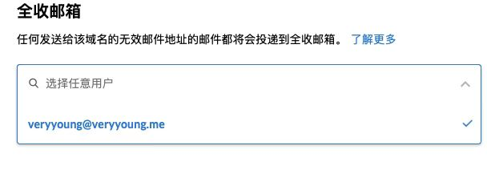

# 如何得到无限邮箱？

国内的网站或平台基本是需要绑定手机号的，但国外的大部分验证邮箱即可，如果能拥有无限邮箱号，就有无限注册账号的可能，如果平台有类似新手活动或需要拉邀请.....剩下的自己体会

以下是我尝试过的几种方式。

## Gmail

### 任意位置加「.」

Gmail 地址中可以随意加「.」，都会发送到原始 Gmail 地址中去，参考：[https://support.google.com/mail/answer/7436150?hl=zh-Hans](https://support.google.com/mail/answer/7436150?hl=zh-Hans])

### 末尾加「+」和任何内容

Gmail 地址末尾可以加「+」和任何内容，都会发送到原始 Gmail 地址中去，参考：[https://support.google.com/a/users/answer/9308648?hl=zh-Hans](https://support.google.com/a/users/answer/9308648?hl=zh-Hans)

### 使用 googlemail.com 后缀

使用 googlemail.com 后缀也可以发送到原始 Gmail 地址中去

### 前三点的结合

## ProtonMail

[ProtonMail](https://protonmail.com) 是一个免费的加密电子邮箱服务，代码开源，使用点对点加密策略，注册不需要任何个人信息，安全性拉满，可无限注册。

## 域名邮箱

### ZOHO

(ZOHO)[https://www.zoho.com/] 是一个免费的域名邮箱，在域名商或第三方 DNS 设置好之后即可拥有企业邮箱，请注意，不要进 ZOHO 中国版，中国版需要太多个人信息，繁琐且不安全。

操作流程参考 [Authenticating an email domain
](https://help.zoho.com/portal/en/kb/backstage/user-guide/setting-up-a-portal/authenticating-your-email-domain/articles/authenticating-your-email-domain#Delete_email_domain)，设置好域名邮箱后设置「全收邮箱」，任何该域名下不存在的邮箱收件都会转发到该「全收邮箱」。

### Yandex

参考 [Yandex.Mail可自定义域名的免费邮局，支持1000用户，每个用户10 GB容量](https://51.ruyo.net/3350.html)

### 腾讯企业邮箱免费

参考 [腾讯企业邮箱免费版部署演示，可实现无限别名](https://51.ruyo.net/4048.html)